# brokr

A finite state machine / workflow engine in Go, backed by Postgres, that implements a substantial subset of UML state-machine semantics: simple and composite states, guarded and automatic transitions, internal (effect-only) transitions, formal fork/join with generation-tracked parallel regions, do-activities, deferred (timeout) transitions, and a shallow/deep history pseudostate. Workflow definitions are plain JSON; instances are dispatched through an actor-per-instance concurrency model so events for different instances run fully in parallel while events for the *same* instance are strictly serialized.

## Table of contents

- [Quick start](#quick-start)
- [Core concepts](#core-concepts)
- [Registering workflow definitions](#registering-workflow-definitions)
- [HTTP API reference](#http-api-reference)
- [Configuration](#configuration)
- [Usage examples](#usage-examples)
  1. [Basic finite state machine](#1-basic-finite-state-machine)
  2. [ActionState, HTTP actions, and context interpolation](#2-actionstate-http-actions-and-context-interpolation)
  3. [Common transitions](#3-common-transitions)
  4. [Guards (choice pseudostate)](#4-guards-choice-pseudostate)
  5. [Automatic transitions and chaining](#5-automatic-transitions-and-chaining)
  6. [Internal transitions](#6-internal-transitions)
  7. [Deferred / timeout transitions](#7-deferred--timeout-transitions)
  8. [Do-activities](#8-do-activities)
  9. [Fork / join — parallel regions](#9-fork--join--parallel-regions)
  10. [Ad hoc child workflows](#10-ad-hoc-child-workflows-legacy-pattern)
  11. [Composite states and the history pseudostate](#11-composite-states-and-the-history-pseudostate)
  12. [Real-time updates over SSE](#12-real-time-updates-over-sse)
  13. [Synchronous vs asynchronous dispatch](#13-synchronous-vs-asynchronous-dispatch)
- [Error responses](#error-responses)
- [Architecture notes](#architecture-notes)
- [Development](#development)

## Quick start

```bash
docker-compose up -d db      # Postgres 16, host port 5436, db "workflow"
go run main.go                # listens on :8080 (or $PORT)
go run ./cmd/seed-workflows   # registers every workflows/*.json definition (e.g. workflows/order-lifecycle.json)
```

Schema migration runs automatically on startup (`AutoMigrate`). Every example below assumes the server is running at `http://localhost:8080` and its workflow definitions are registered via `cmd/seed-workflows` — see [Registering workflow definitions](#registering-workflow-definitions).

## Core concepts

**Workflow** — a JSON document describing states, transitions, and (optionally) common transitions shared by many states:

```json
{
  "id": "string",
  "version": "string",
  "deprecated": false,
  "initialState": "id of a state in \"states\"",
  "endStates": ["id", "id"],
  "states": [ /* State objects */ ],
  "transitions": [ /* Transition objects */ ],
  "commonTransitions": [ /* CommonTransition objects, optional */ ]
}
```

**States** — three concrete types, discriminated by `"type"`:

| `type` | Purpose |
|---|---|
| `SimpleState` | A plain state — no actions of its own. |
| `ActionState` | Adds `entryActions`, `exitActions`, and `doActions`. |
| `CompositeState` | Contains exactly one level of nested substates (`substates`, `subTransitions`) plus an optional history pseudostate. |

All three share these fields: `id`, `frontendBullet`, `bulletName`, `resumeEvent`, `productStatus`, `status`.

**Transitions** — moves from `source` to `target` when `event` is dispatched:

```json
{
  "type": "USER | AUTOMATIC | SYSTEM",
  "kind": "External | Internal | Fork | Join",
  "source": "stateId",
  "target": "stateId",
  "event": "eventName",
  "guard": { "key": "ctxKey", "op": "eq|neq|gt|gte|lt|lte|exists|not_exists", "value": "..." },
  "entryActions": [ /* Action objects, run after the target state's own entry actions */ ],
  "after": "duration string, e.g. \"15m\" (AUTOMATIC only)",
  "forkTargets": [ /* Fork only */ ],
  "entersHistory": false
}
```

- `type` (the JSON key, mapped to `Trigger` in Go) classifies *who* fires the transition. It is metadata that gates automatic behavior (see [§5](#5-automatic-transitions-and-chaining) and [§7](#7-deferred--timeout-transitions)) — `USER`/`SYSTEM` transitions are only ever fired by an explicit `POST .../events`; brokr does not distinguish `USER` from `SYSTEM` beyond documentation intent.
- `kind` (mapped to `Kind`) is the UML transition kind. Omitted/absent means `External` (exit source, enter target — the default). See [§6](#6-internal-transitions) for `Internal`, [§9](#9-fork--join--parallel-regions) for `Fork`/`Join`.
- First-match-wins: when several transitions share the same `(source, event)`, the first one in `transitions` whose `guard` passes is the one that fires. Order matters — see [§4](#4-guards-choice-pseudostate).
- A legacy boolean `"join": true` is still honored as equivalent to `"kind": "Join"` for backward compatibility; new definitions should use `kind`.

**Actions** — run as part of a state's entry/exit/do-activity, or a transition's own `entryActions`:

```json
{ "type": "HttpRequestAction", "method": "POST", "url": "https://...", "expectResponse": true, "forwardToken": true, "variables": {"key": "${ctxVar}"} }
{ "type": "SetContextMapAction", "variables": {"key": "literalOrInterpolatedValue"} }
{ "type": "CreateChildWorkflowAction", "childWorkflow": { /* a nested Workflow */ } }
```

- `${varName}` in any `url` or `variables` value is interpolated against the instance's persisted **context map**.
- The context map is populated two ways: literal values via `SetContextMapAction`, or an `HttpRequestAction` with `expectResponse: true` whose JSON response body is merged key-by-key into the map. **There is no way to inject arbitrary payload data from the event-dispatch API call itself** — `POST .../events` takes only `?event=name` in the query string, no body. If you need caller-supplied data in the context, front the state transition with an `ActionState` that fetches it from your own service.
- A non-`expectResponse` `HttpRequestAction` runs fire-and-forget on a small bounded worker pool and never blocks the transition.
- `GET /workflows/:id/context` shows the current context map at any time — useful for following the examples below.

**Guards** — evaluated against the context map; a `nil`/absent guard always passes. See [§4](#4-guards-choice-pseudostate).

## Registering workflow definitions

Workflow definitions are no longer POSTed inline. Instead:

1. Write a definition as simplified JSON — only `id` and `states` are required; everything else (`version`, `creationDate`/`updateDate`, `initialState`, each state's `type` (defaults to `SimpleState`), each state's `status`/`productStatus`/`bulletName`, a `CompositeState`'s `initialSubstate` (defaults to its first substate), each transition's `type`/`kind`, each `HttpRequestAction`'s `method`) is filled in with a sensible default if omitted. An omitted `kind` on the top-level definition — or any value at all — is always registered as `"USER"`; it's not an author-settable field. See `workflows/order-lifecycle.json` for a minimal example, and any of the [worked examples](#usage-examples) below for the full field set a definition can use.
2. Drop the file in `workflows/` (one definition per `*.json` file).
3. Run the registration job: `go run ./cmd/seed-workflows` (add `-dir=<path>` to use a different directory). It upserts every file in the directory into the database, keyed by the definition's `id`.
4. Create instances of it via `POST /workflows {"name": "<id>"}`.

The four fields that classify a transition, a transition's kind, an action, or a guard — `type` (`AUTOMATIC`/`USER`/`SYSTEM`), `kind` (`EXTERNAL`/`INTERNAL`/`FORK`/`JOIN`), an action's `type` (`HTTPREQUESTACTION`/`SETCONTEXTMAPACTION`/`CREATECHILDWORKFLOWACTION`), and a guard's `op` (`EQ`/`NEQ`/`GT`/`GTE`/`LT`/`LTE`/`EXISTS`/`NOT_EXISTS`) — accept any case in the source JSON (`"automatic"`, `"Automatic"`, `"AUTOMATIC"` all work) but are always canonicalized to uppercase once registered; an unrecognized value is a registration error, not a silently-ignored one.

## HTTP API reference

| Method | Path | Body | Response |
|---|---|---|---|
| `POST` | `/workflows` | `{"name": "<workflow-name>"}` | `201 {"id": "..."}` |
| `GET` | `/workflows/:id` | — | `200` the workflow **definition** (see note below) |
| `POST` | `/workflows/:id/events?event=name[&async=true]` | — | sync: `200` the resulting state id (a JSON string); async: `202 {"status":"accepted","id":"...","event":"..."}` |
| `GET` | `/workflows/:id/possible-events` | — | `200` `["event1", "event2", ...]` |
| `GET` | `/workflows/:id/context` | — | `200` the instance's context map, `{"key": "value", ...}` |
| `GET` | `/workflows/:id/events/stream` | — | SSE stream of transition events |
| `POST` | `/workflows/:id/children` | a `Workflow` JSON document | `201 {"id": "..."}` — ad hoc child, see [§10](#10-ad-hoc-child-workflows-legacy-pattern) |
| `GET` | `/workflows/:id/children` | — | `200` `[{"id":"...","currentState":{...},"complete":bool}, ...]` |
| `DELETE` | `/workflows/:id/children/:childId` | — | `200 {"withdrawn": "childId"}` |

> **Note on `GET /workflows/:id`:** it returns the static workflow **definition** the instance was created from, not its live position. To observe an instance's current state, read the response body of the event that moved it there, or subscribe over SSE (§12), which carries both the current state and (if applicable) the active composite substate.
>
> **Note on the event-dispatch response:** the returned state id is always the *outer* state's id. If the instance is currently positioned inside a `CompositeState`'s substate, this reports the composite's own id, not the substate — use the SSE stream or `GET .../possible-events` (which is substate-aware) to see the precise position.

## Configuration

| Env var | Default | Purpose |
|---|---|---|
| `PORT` | `8080` | HTTP listen port |
| `DB_HOST` | `127.0.0.1` | Postgres host |
| `DB_PORT` | `5436` | Postgres port |
| `DB_USER` | `misen` | Postgres user |
| `DB_PASSWORD` | `root` | Postgres password |
| `DB_NAME` | `workflow` | Postgres database |
| `DB_SSLMODE` | `disable` | Postgres sslmode |
| `DB_MAX_OPEN_CONNS` | `40` | connection pool max open |
| `DB_MAX_IDLE_CONNS` | `20` | connection pool max idle |
| `DB_CONN_MAX_LIFETIME_SEC` | `1800` | connection max lifetime |
| `DB_CONN_MAX_IDLE_SEC` | `300` | connection max idle time |
| `BROKR_HTTP_TIMEOUT_SEC` | `30` | timeout for outbound `HttpRequestAction` calls |
| `BROKR_ASYNC_WORKERS` | `2 × GOMAXPROCS` | worker-pool size for fire-and-forget HTTP actions |
| `BROKR_ASYNC_QUEUE` | `1024` | worker-pool queue depth (backpressure applies past this) |
| `BROKR_SSE_BUFFER` | `256` | per-subscriber SSE channel buffer |

---

## Usage examples

Every example below is a complete, valid `Workflow` document — but as of [Registering workflow definitions](#registering-workflow-definitions), you register it as a file in `workflows/` and run `go run ./cmd/seed-workflows`, then create instances with `POST /workflows {"name": "<id>"}`, rather than POSTing the document itself.

### 1. Basic finite state machine

The simplest case: `SimpleState`s connected by plain (`External`, `USER`-triggered) transitions. An order lifecycle:

```json
{
  "id": "order-lifecycle",
  "version": "1.0",
  "initialState": "created",
  "endStates": ["delivered", "cancelled"],
  "states": [
    { "type": "SimpleState", "id": "created",   "bulletName": "Order Created" },
    { "type": "SimpleState", "id": "paid",      "bulletName": "Payment Received" },
    { "type": "SimpleState", "id": "shipped",   "bulletName": "Shipped" },
    { "type": "SimpleState", "id": "delivered", "bulletName": "Delivered" },
    { "type": "SimpleState", "id": "cancelled", "bulletName": "Cancelled" }
  ],
  "transitions": [
    { "type": "USER", "source": "created", "target": "paid",      "event": "pay" },
    { "type": "USER", "source": "paid",    "target": "shipped",   "event": "ship" },
    { "type": "USER", "source": "shipped", "target": "delivered", "event": "deliver" },
    { "type": "USER", "source": "created", "target": "cancelled", "event": "cancel" }
  ]
}
```

**Flow:**

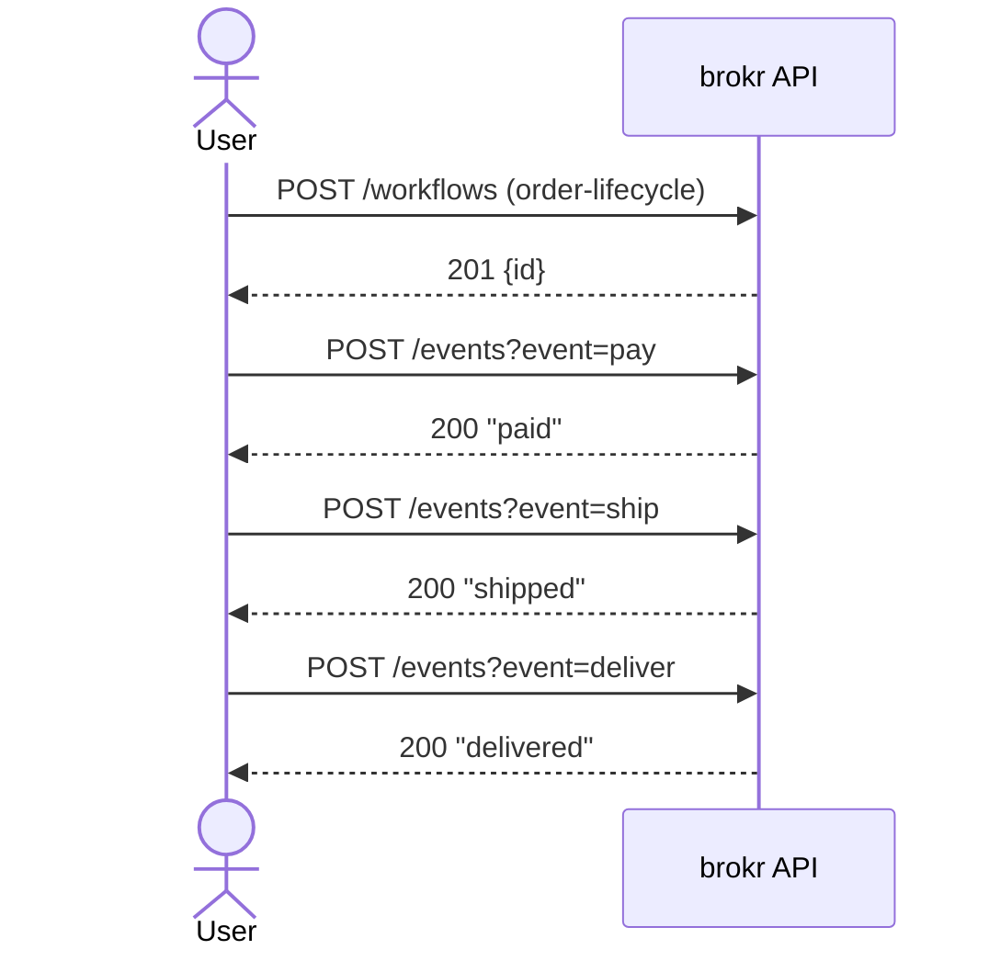

Every step is a plain request/response — the User drives each transition explicitly, one event at a time, and each call blocks until the new state is committed.

```bash
cp order-lifecycle.json workflows/ && go run ./cmd/seed-workflows
ID=$(curl -s -X POST localhost:8080/workflows -H "Content-Type: application/json" -d '{"name":"order-lifecycle"}' | jq -r .id)

curl -s "localhost:8080/workflows/$ID/possible-events"
# ["pay","cancel"]

curl -s -X POST "localhost:8080/workflows/$ID/events?event=pay"
# "paid"

curl -s -X POST "localhost:8080/workflows/$ID/events?event=ship"
# "shipped"

curl -s -X POST "localhost:8080/workflows/$ID/events?event=deliver"
# "delivered"
```

Sending `pay` again at this point returns `500 {"error":"no transition found for event 'pay' in state 'delivered'"}` — there's no such transition once you're past `created`.

### 2. ActionState, HTTP actions, and context interpolation

`ActionState` adds `entryActions`/`exitActions`. `SetContextMapAction` seeds the context map with literal values; `HttpRequestAction` interpolates `${var}` from it. A payment flow that charges a card:

```json
{
  "id": "payment-flow",
  "version": "1.0",
  "initialState": "awaiting_payment",
  "endStates": ["payment_confirmed", "payment_failed"],
  "states": [
    { "type": "SimpleState", "id": "awaiting_payment", "bulletName": "Awaiting Payment" },
    {
      "type": "ActionState",
      "id": "charging_card",
      "bulletName": "Charging Card",
      "expectResponse": true,
      "entryActions": [
        { "type": "SetContextMapAction", "variables": { "orderId": "ORD-48213", "amount": "49.99" } },
        {
          "type": "HttpRequestAction",
          "method": "POST",
          "url": "https://payments.internal/api/v1/orders/${orderId}/charge",
          "expectResponse": true,
          "forwardToken": true,
          "variables": { "amount": "${amount}" }
        }
      ]
    },
    { "type": "SimpleState", "id": "payment_confirmed", "bulletName": "Payment Confirmed" },
    { "type": "SimpleState", "id": "payment_failed", "bulletName": "Payment Failed" }
  ],
  "transitions": [
    { "type": "USER", "source": "awaiting_payment", "target": "charging_card", "event": "submit_payment" },
    { "type": "USER", "source": "charging_card", "target": "payment_confirmed", "event": "charge_succeeded" },
    { "type": "USER", "source": "charging_card", "target": "payment_failed", "event": "charge_failed" }
  ]
}
```

**Flow:**

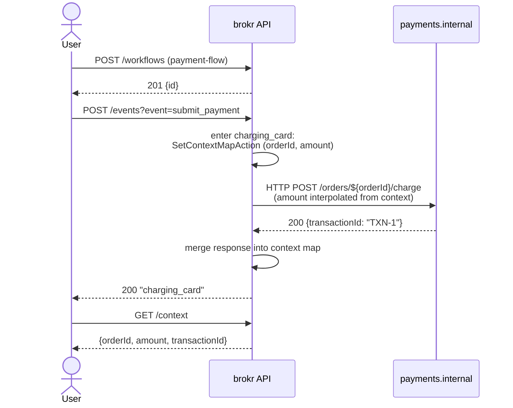

The `HttpRequestAction`'s response is awaited synchronously (since `expectResponse: true`) — the transition doesn't complete, and `submit_payment` doesn't return to the User, until `payments.internal` replies and its JSON is merged into the context.

Actions within one list (a state's `entryActions`, here) run **serially in order**, so `HttpRequestAction` sees `orderId`/`amount` written by the `SetContextMapAction` immediately before it. This ordering matters: a transition's own `entryActions` run *after* the target state's `entryActions` have already finished, so don't rely on a transition-level `SetContextMapAction` to seed a value the target state's own entry actions need — put it earlier, in the target state's own list, as above.

```bash
cp payment-flow.json workflows/ && go run ./cmd/seed-workflows
ID=$(curl -s -X POST localhost:8080/workflows -H "Content-Type: application/json" -d '{"name":"payment-flow"}' | jq -r .id)
curl -s -X POST "localhost:8080/workflows/$ID/events?event=submit_payment"
curl -s "localhost:8080/workflows/$ID/context"
# {"orderId":"ORD-48213","amount":"49.99"}
```

If `https://payments.internal/...` responds `200 {"transactionId":"TXN-1"}`, that key is merged into the context too (visible on the next `GET .../context`).

### 3. Common transitions

A `commonTransition` is shared by every state listed in `sourceList` — avoids repeating the same `withdraw`/`cancel`/`timeout` transition on every state of a long linear flow.

```json
{
  "id": "account-opening",
  "version": "1.0",
  "initialState": "personal_details",
  "endStates": ["account_active", "withdrawn"],
  "states": [
    { "type": "SimpleState", "id": "personal_details", "bulletName": "Personal Details" },
    { "type": "SimpleState", "id": "identity_check",    "bulletName": "Identity Check" },
    { "type": "SimpleState", "id": "account_active",    "bulletName": "Account Active" },
    { "type": "SimpleState", "id": "withdrawn",          "bulletName": "Application Withdrawn" }
  ],
  "transitions": [
    { "type": "USER", "source": "personal_details", "target": "identity_check", "event": "submit_details" },
    { "type": "USER", "source": "identity_check",    "target": "account_active", "event": "verify" }
  ],
  "commonTransitions": [
    {
      "sourceList": ["personal_details", "identity_check"],
      "target": "withdrawn",
      "event": "withdraw",
      "entryActions": [
        { "type": "SetContextMapAction", "variables": { "withdrawalReason": "user_requested" } }
      ]
    }
  ]
}
```

**Flow:**

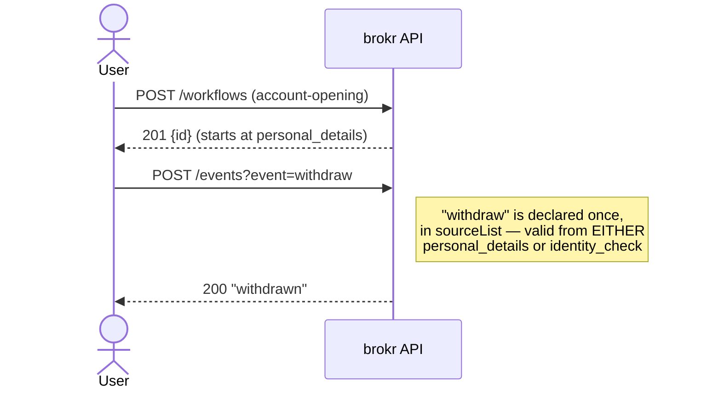

Whichever state the User happens to be in when they withdraw, the same single `commonTransition` declaration handles it — there's no need for a separate `withdraw` transition per state.

```bash
cp account-opening.json workflows/ && go run ./cmd/seed-workflows
ID=$(curl -s -X POST localhost:8080/workflows -H "Content-Type: application/json" -d '{"name":"account-opening"}' | jq -r .id)
curl -s "localhost:8080/workflows/$ID/possible-events"
# ["submit_details","withdraw"]   -- withdraw comes from the commonTransition

curl -s -X POST "localhost:8080/workflows/$ID/events?event=withdraw"
# "withdrawn"
```

`withdraw` works identically whether the instance is at `personal_details` or `identity_check` — one declaration, many source states. `commonTransitions` also accept `type`/`kind`/`guard`, exactly like a regular `Transition`.

### 4. Guards (choice pseudostate)

A `guard` gates whether a transition is eligible. Several transitions can share the same `(source, event)` — the **first** whose guard passes wins, so order high-specificity guards before broad ones.

```json
{
  "id": "credit-check",
  "version": "1.0",
  "initialState": "application_submitted",
  "endStates": ["approved", "manual_review", "rejected"],
  "states": [
    { "type": "SimpleState", "id": "application_submitted", "bulletName": "Application Submitted" },
    { "type": "SimpleState", "id": "risk_scored",            "bulletName": "Risk Scored" },
    { "type": "SimpleState", "id": "approved",                "bulletName": "Approved" },
    { "type": "SimpleState", "id": "manual_review",           "bulletName": "Manual Review" },
    { "type": "SimpleState", "id": "rejected",                "bulletName": "Rejected" }
  ],
  "transitions": [
    {
      "type": "SYSTEM", "source": "application_submitted", "target": "risk_scored", "event": "risk_score_received",
      "entryActions": [{ "type": "SetContextMapAction", "variables": { "riskScore": "85" } }]
    },
    {
      "type": "USER", "source": "risk_scored", "target": "rejected", "event": "route",
      "guard": { "key": "riskScore", "op": "gte", "value": "80" }
    },
    {
      "type": "USER", "source": "risk_scored", "target": "manual_review", "event": "route",
      "guard": { "key": "riskScore", "op": "gte", "value": "30" }
    },
    {
      "type": "USER", "source": "risk_scored", "target": "approved", "event": "route",
      "guard": { "key": "riskScore", "op": "lt", "value": "30" }
    }
  ]
}
```

Note the ordering: `gte 80` is checked before `gte 30` before `lt 30`. If the transitions were reversed, a score of `85` would incorrectly match `gte 30` (manual review) first, since it too evaluates true and comes earlier.

**Flow:**

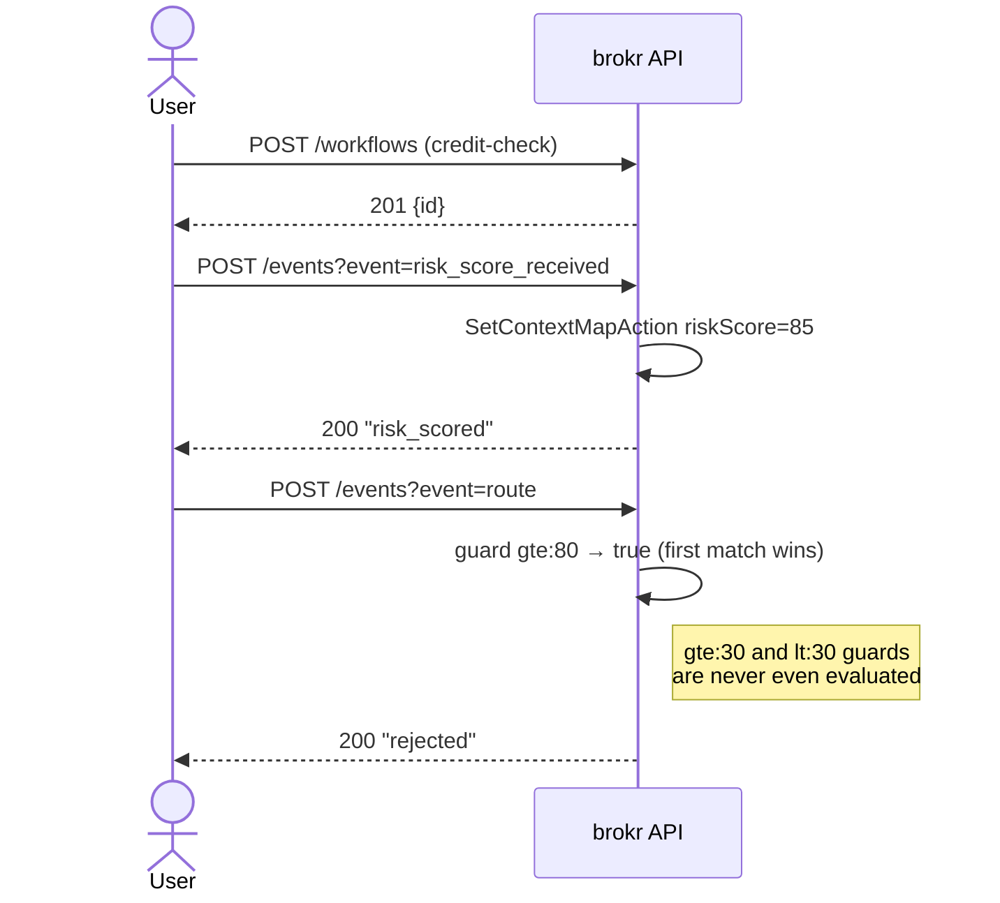

Only the first passing guard, in authored order, ever fires — the other two candidate transitions for the same `(source, event)` are simply skipped once one matches.

```bash
cp credit-check.json workflows/ && go run ./cmd/seed-workflows
ID=$(curl -s -X POST localhost:8080/workflows -H "Content-Type: application/json" -d '{"name":"credit-check"}' | jq -r .id)
curl -s -X POST "localhost:8080/workflows/$ID/events?event=risk_score_received"
curl -s -X POST "localhost:8080/workflows/$ID/events?event=route"
# "rejected"   (riskScore=85 matched the first, gte:80, guard)
```

In this demo the score is a hardcoded literal for reproducibility; in production it would arrive via an `expectResponse` `HttpRequestAction` calling a real scoring service (see [§2](#2-actionstate-http-actions-and-context-interpolation)), whose response merges `riskScore` into the context before `route` is dispatched.

**Available operators:** `eq`, `neq`, `gt`, `gte`, `lt`, `lte` (numeric, parsed as float64 — a non-numeric value fails the guard rather than falling back to string comparison), `exists`, `not_exists`.

### 5. Automatic transitions and chaining

`"type": "AUTOMATIC"` with no `after` fires the instant its source state is entered — no client call needed. Automatic transitions can chain (A automatically leads to B which automatically leads to C…), capped at 100 hops to catch an authoring cycle.

```json
{
  "id": "onboarding-intake",
  "version": "1.0",
  "initialState": "application_started",
  "endStates": ["ready_for_review"],
  "states": [
    { "type": "SimpleState", "id": "application_started",      "bulletName": "Application Started" },
    { "type": "SimpleState", "id": "applicant_type_selection",  "bulletName": "Applicant Type Selection" },
    { "type": "SimpleState", "id": "ready_for_review",          "bulletName": "Ready for Review" }
  ],
  "transitions": [
    { "type": "AUTOMATIC", "source": "application_started", "target": "applicant_type_selection", "event": "start" },
    { "type": "USER", "source": "applicant_type_selection", "target": "ready_for_review", "event": "select_type" }
  ]
}
```

**Flow:**

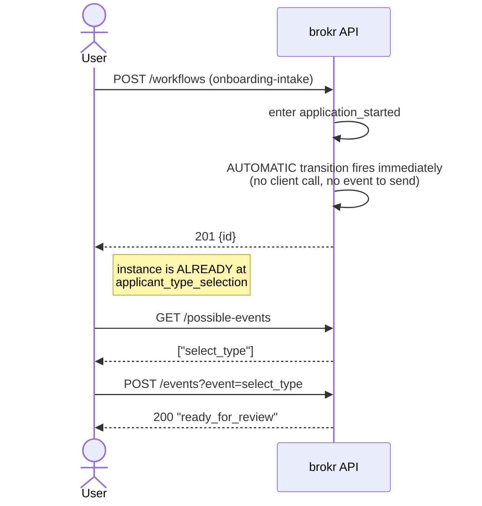

The User never sends `start` — it isn't even a valid event to send manually in the sense that matters here; the hop happens on its own, synchronously, before `POST /workflows` even returns.

```bash
cp onboarding-intake.json workflows/ && go run ./cmd/seed-workflows
ID=$(curl -s -X POST localhost:8080/workflows -H "Content-Type: application/json" -d '{"name":"onboarding-intake"}' | jq -r .id)
curl -s "localhost:8080/workflows/$ID/possible-events"
# ["select_type"]   -- the instance already auto-advanced past application_started
```

No event was sent, yet the instance is already at `applicant_type_selection` — the `AUTOMATIC` hop ran synchronously as part of `POST /workflows`, before the id was even returned. `AUTOMATIC` transitions are excluded from `GET .../possible-events` (they aren't something a client ever "sends") — a guard-failing `AUTOMATIC` transition simply doesn't fire, and the instance stays put (or falls through to the next candidate).

### 6. Internal transitions

`"kind": "Internal"` runs its own `entryActions` as a pure side effect — no exit/entry actions of the state itself fire, and the instance never actually leaves the state (do-activities and pending timers on that state are undisturbed).

```json
{
  "id": "retry-demo",
  "version": "1.0",
  "initialState": "waiting_for_confirmation",
  "endStates": ["confirmed"],
  "states": [
    { "type": "SimpleState", "id": "waiting_for_confirmation", "bulletName": "Waiting for Confirmation" },
    { "type": "SimpleState", "id": "confirmed", "bulletName": "Confirmed" }
  ],
  "transitions": [
    {
      "type": "USER", "kind": "Internal",
      "source": "waiting_for_confirmation", "target": "waiting_for_confirmation",
      "event": "reminder_sent",
      "entryActions": [
        { "type": "SetContextMapAction", "variables": { "lastReminder": "sent" } }
      ]
    },
    { "type": "USER", "source": "waiting_for_confirmation", "target": "confirmed", "event": "confirm" }
  ]
}
```

**Flow:**

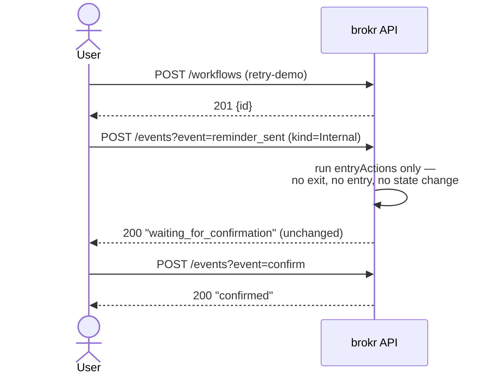

`reminder_sent` can be sent any number of times — each call updates the context (`lastReminder`) but the instance never leaves `waiting_for_confirmation`, so nothing about the state itself (its entry/exit actions, any running do-activity) is disturbed.

```bash
cp retry-demo.json workflows/ && go run ./cmd/seed-workflows
ID=$(curl -s -X POST localhost:8080/workflows -H "Content-Type: application/json" -d '{"name":"retry-demo"}' | jq -r .id)
curl -s -X POST "localhost:8080/workflows/$ID/events?event=reminder_sent"
# "waiting_for_confirmation"  -- unchanged; only the context map was touched
curl -s "localhost:8080/workflows/$ID/context"
# {"lastReminder":"sent"}
```

`target` is conventionally set equal to `source` for readability, but the engine never reads it for an `Internal` transition — only `entryActions` runs.

### 7. Deferred / timeout transitions

An `AUTOMATIC` transition with a non-empty `after` (a Go duration string) is scheduled on a per-instance timer the moment its source state is entered, instead of firing immediately. If a real event moves the instance out of that state first, the pending timer is cancelled.

```json
{
  "id": "payment-window",
  "version": "1.0",
  "initialState": "awaiting_payment",
  "endStates": ["paid", "expired"],
  "states": [
    { "type": "SimpleState", "id": "awaiting_payment", "bulletName": "Awaiting Payment" },
    { "type": "SimpleState", "id": "paid",     "bulletName": "Paid" },
    { "type": "SimpleState", "id": "expired",  "bulletName": "Expired" }
  ],
  "transitions": [
    { "type": "USER", "source": "awaiting_payment", "target": "paid", "event": "pay" },
    { "type": "AUTOMATIC", "source": "awaiting_payment", "target": "expired", "event": "timeout", "after": "15m" }
  ]
}
```

**Flow:**

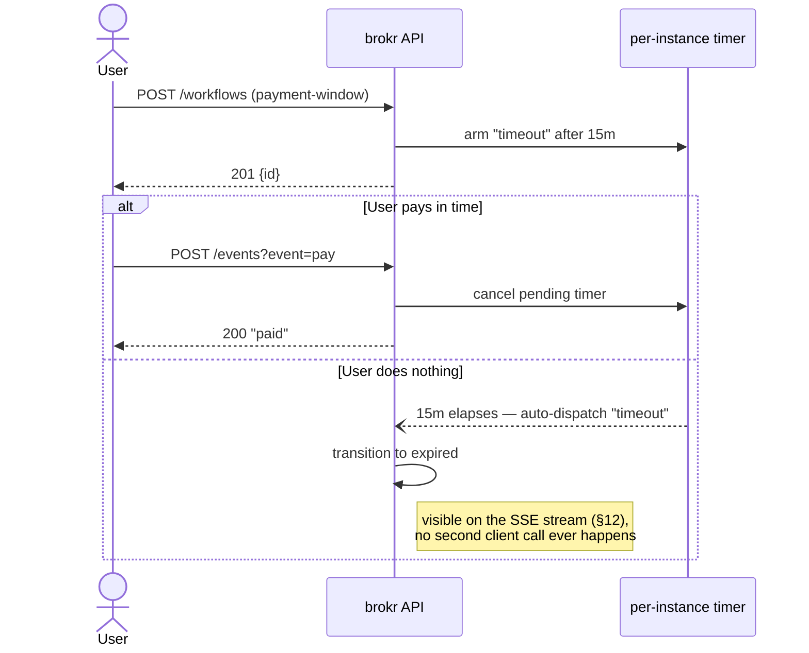

Only one of the two branches happens per instance — whichever comes first, the real `pay` event or the timer's own deadline, wins and cancels the other.

```bash
cp payment-window.json workflows/ && go run ./cmd/seed-workflows
ID=$(curl -s -X POST localhost:8080/workflows -H "Content-Type: application/json" -d '{"name":"payment-window"}' | jq -r .id)
# Option A: pay in time — the 15m timer is cancelled, no "timeout" ever fires.
curl -s -X POST "localhost:8080/workflows/$ID/events?event=pay"

# Option B: do nothing. After 15 minutes the engine itself dispatches "timeout"
# (visible on the SSE stream — see §12); the instance ends up "expired" with
# no client ever calling the API a second time.
```

For local testing, use a short duration like `"after": "5s"` and watch the SSE stream (§12) to see it fire without any further client interaction. Timers live in memory on the instance's actor goroutine — they don't survive a process restart (a documented limitation, not a bug); a still-pending deferred transition is silently disarmed by a redeploy and will need to be re-armed by whatever re-triggers the source state.

### 8. Do-activities

`doActions` (only on `ActionState`) run once, in the background, for as long as the instance remains in that state — they don't block the transition that entered the state, and are cancelled the instant any transition (including the state's own exit) leaves it.

```json
{
  "id": "report-generation",
  "version": "1.0",
  "initialState": "generating_report",
  "endStates": ["report_ready", "cancelled"],
  "states": [
    {
      "type": "ActionState",
      "id": "generating_report",
      "bulletName": "Generating Report",
      "doActions": [
        {
          "type": "HttpRequestAction",
          "method": "POST",
          "url": "https://reports.internal/api/v1/generate",
          "expectResponse": false,
          "variables": { "reportId": "RPT-9001" }
        }
      ]
    },
    { "type": "SimpleState", "id": "report_ready", "bulletName": "Report Ready" },
    { "type": "SimpleState", "id": "cancelled", "bulletName": "Cancelled" }
  ],
  "transitions": [
    { "type": "SYSTEM", "source": "generating_report", "target": "report_ready", "event": "report_done" },
    { "type": "USER", "source": "generating_report", "target": "cancelled", "event": "cancel" }
  ]
}
```

**Flow:**

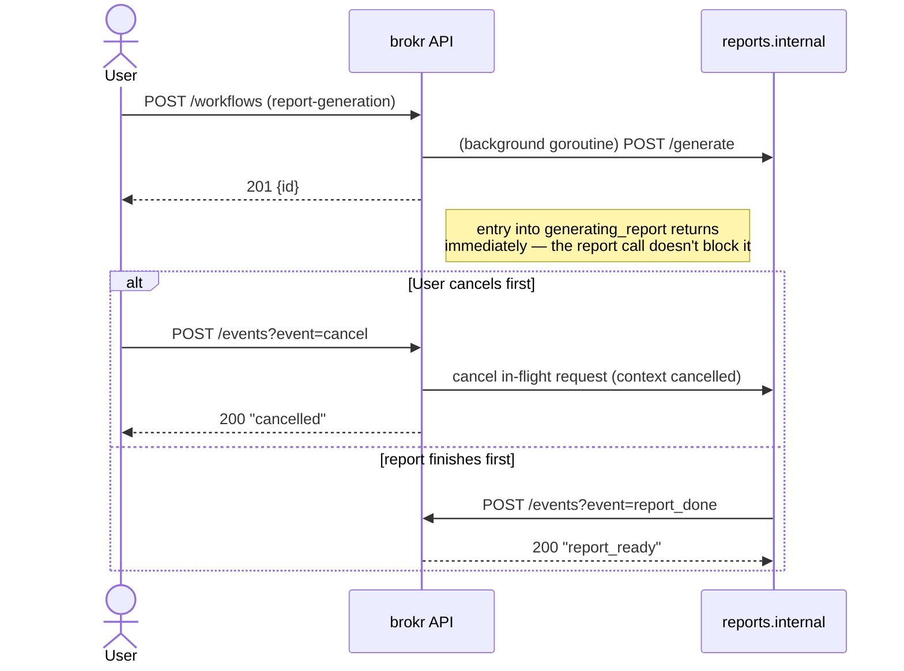

The do-activity call to `reports.internal` starts the instant `generating_report` is entered and runs concurrently with everything else — the `cancel` path and the "report finishes" path race, and whichever transition actually fires first cancels the do-activity's context if it was still in flight.

```bash
cp report-generation.json workflows/ && go run ./cmd/seed-workflows
ID=$(curl -s -X POST localhost:8080/workflows -H "Content-Type: application/json" -d '{"name":"report-generation"}' | jq -r .id)
# The generate-report call is already running in the background at this point.

# If the caller cancels before the report finishes, the in-flight HTTP
# request's context is cancelled too:
curl -s -X POST "localhost:8080/workflows/$ID/events?event=cancel"
```

Do-activities run exactly once (they are not a repeating poller) and start fresh with an empty context map — they can't read `${var}`s from the instance's own accumulated context, and any `SetContextMapAction` inside a do-activity's action list is discarded rather than merged back (the do-activity runs concurrently with, not as part of, the transaction that owns the instance's real context).

### 9. Fork / join — parallel regions

A `Kind: "Fork"` transition atomically spawns one or more child workflow instances (`forkTargets`), each an independent, fully-formed `Workflow` of its own, and stamps them all with a shared generation id. A `Kind: "Join"` transition is watched by the engine itself: the instant every child in that generation reaches one of its own `endStates`, the join fires **automatically** — no client has to poll or explicitly dispatch it.

```json
{
  "id": "joint-application",
  "version": "1.0",
  "initialState": "account_type_selected",
  "endStates": ["application_complete"],
  "states": [
    { "type": "SimpleState", "id": "account_type_selected",   "bulletName": "Account Type Selected" },
    { "type": "SimpleState", "id": "awaiting_both_applicants", "bulletName": "Awaiting Both Applicants" },
    { "type": "SimpleState", "id": "application_complete",     "bulletName": "Application Complete" }
  ],
  "transitions": [
    {
      "type": "USER", "kind": "Fork",
      "source": "account_type_selected", "target": "awaiting_both_applicants",
      "event": "fork_joint_applicants",
      "forkTargets": [
        {
          "ref": "primary_applicant",
          "childWorkflow": {
            "id": "applicant-kyc", "version": "1.0",
            "initialState": "kyc_pending", "endStates": ["kyc_complete"],
            "states": [
              { "type": "SimpleState", "id": "kyc_pending",  "bulletName": "KYC Pending" },
              { "type": "SimpleState", "id": "kyc_complete", "bulletName": "KYC Complete" }
            ],
            "transitions": [
              { "type": "USER", "source": "kyc_pending", "target": "kyc_complete", "event": "complete_kyc" }
            ]
          }
        },
        {
          "ref": "secondary_applicant",
          "childWorkflow": {
            "id": "applicant-kyc", "version": "1.0",
            "initialState": "kyc_pending", "endStates": ["kyc_complete"],
            "states": [
              { "type": "SimpleState", "id": "kyc_pending",  "bulletName": "KYC Pending" },
              { "type": "SimpleState", "id": "kyc_complete", "bulletName": "KYC Complete" }
            ],
            "transitions": [
              { "type": "USER", "source": "kyc_pending", "target": "kyc_complete", "event": "complete_kyc" }
            ]
          }
        }
      ]
    },
    {
      "kind": "Join",
      "source": "awaiting_both_applicants", "target": "application_complete",
      "event": "both_applicants_done"
    }
  ]
}
```

**Flow:**

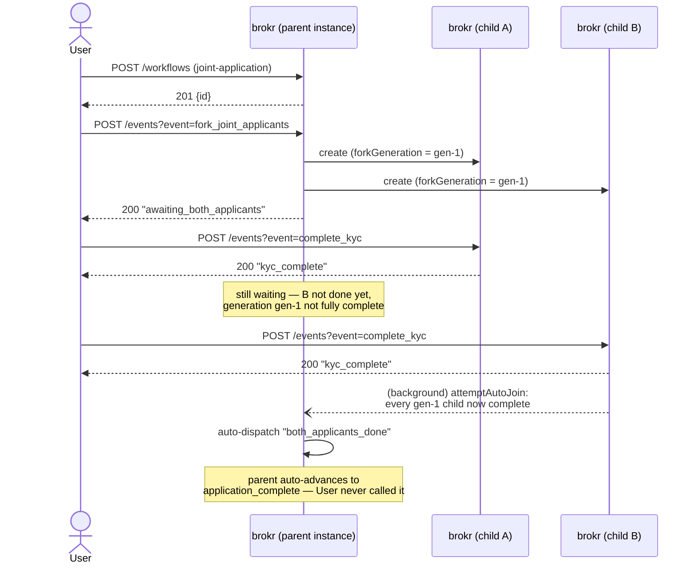

> **Do not mark a `Join` transition's `type` as `"AUTOMATIC"`.** Auto-join fires it by matching `kind: "Join"` alone, irrespective of `type` — but if `type` is also `"AUTOMATIC"`, the engine's *automatic-chaining* logic (used for [§5](#5-automatic-transitions-and-chaining)) has no concept of join-gating and will fire the transition the instant `awaiting_both_applicants` is entered, immediately and unconditionally, before either child has done anything. Leave `type` unset (as above) so it's picked up only by auto-join's children-complete check, never by the plain automatic-chain path.

```bash
cp joint-application.json workflows/ && go run ./cmd/seed-workflows
ID=$(curl -s -X POST localhost:8080/workflows -H "Content-Type: application/json" -d '{"name":"joint-application"}' | jq -r .id)
curl -s -X POST "localhost:8080/workflows/$ID/events?event=fork_joint_applicants"
# "awaiting_both_applicants" — both children were created in the same call

CHILDREN=$(curl -s "localhost:8080/workflows/$ID/children")
echo "$CHILDREN" | jq .
# [{"id":"...","currentState":{"id":"kyc_pending",...},"complete":false},
#  {"id":"...","currentState":{"id":"kyc_pending",...},"complete":false}]

CHILD_A=$(echo "$CHILDREN" | jq -r '.[0].id')
CHILD_B=$(echo "$CHILDREN" | jq -r '.[1].id')

curl -s -X POST "localhost:8080/workflows/$CHILD_A/events?event=complete_kyc"
curl -s "localhost:8080/workflows/$ID/possible-events"
# ["both_applicants_done"] — the join is still pending; only one child is done,
# so it hasn't fired (neither automatically nor would a manual call succeed)

curl -s -X POST "localhost:8080/workflows/$CHILD_B/events?event=complete_kyc"
# the moment this commits, the engine auto-dispatches "both_applicants_done"
# on the parent in the background — no explicit join call needed.
```

Give the async auto-join a moment (it fires from a background goroutine right after the second child's transaction commits), then confirm:

```bash
curl -s "localhost:8080/workflows/$ID/possible-events"
# null (empty) — the parent has already auto-advanced to application_complete (an end state)
```

A join can still be dispatched manually too (`POST .../events?event=both_applicants_done`) — useful for tests or manual recovery — but it will fail with the same `ChildrenNotCompleteError` as [§10](#10-ad-hoc-child-workflows-legacy-pattern)'s legacy join if children aren't done yet.

**Known limitation:** fork-spawned children are inserted independently of the parent's own transition transaction. If something later in the same event-processing call fails (a subsequent automatic hop errors, for instance), the DB rolls back the parent's `Fork` transition but the already-committed children remain, orphaned from a `pendingForkGeneration` the parent never actually recorded. This is a documented gap, not a silent one — see `engine/transitions.go`.

### 10. Ad hoc child workflows (legacy pattern)

Before formal `Fork`/`Join`, children were created via a `CreateChildWorkflowAction` in a transition's `entryActions`, and a plain `"join": true` boolean gated on **every** non-withdrawn child the instance has ever had (no generation scoping). This still works, unchanged, for simpler one-off children that don't need formal fork/join semantics:

`POST /workflows/:id/children` — the other way to create an ad hoc child, spawned directly under an existing instance rather than via a transition's action list — is also part of this legacy pattern. Unlike `POST /workflows`, it still takes a full inline `Workflow` document and does not run it through the defaulting/normalization pipeline described in [Registering workflow definitions](#registering-workflow-definitions) — you must supply every field explicitly, including `kind` if you want it recorded as anything other than its JSON zero value.

```json
{
  "id": "single-child-demo",
  "version": "1.0",
  "initialState": "start",
  "endStates": ["done"],
  "states": [
    { "type": "SimpleState", "id": "start", "bulletName": "Start" },
    { "type": "SimpleState", "id": "waiting_on_child", "bulletName": "Waiting on Child" },
    { "type": "SimpleState", "id": "done", "bulletName": "Done" }
  ],
  "transitions": [
    {
      "type": "USER", "source": "start", "target": "waiting_on_child", "event": "spawn_child",
      "entryActions": [
        {
          "type": "CreateChildWorkflowAction",
          "childWorkflow": {
            "id": "background-task", "version": "1.0",
            "initialState": "running", "endStates": ["finished"],
            "states": [
              { "type": "SimpleState", "id": "running", "bulletName": "Running" },
              { "type": "SimpleState", "id": "finished", "bulletName": "Finished" }
            ],
            "transitions": [
              { "type": "USER", "source": "running", "target": "finished", "event": "finish" }
            ]
          }
        }
      ]
    },
    { "type": "USER", "source": "waiting_on_child", "target": "done", "event": "check_done", "join": true }
  ]
}
```

**Flow:**

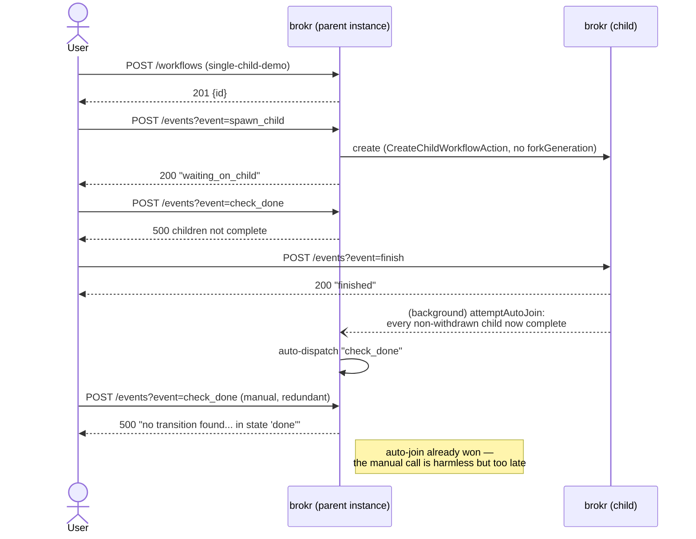

Like §9's formal join, a legacy `"join": true` transition is *also* picked up by auto-join — `attemptAutoJoin` fires on `IsJoin()` alone, which is true for either form. The only real difference from §9 is scope: with no `forkGeneration` stamped on this child (ad hoc `CreateChildWorkflowAction` never sets one), the completeness check falls back to *every non-withdrawn child the instance has ever had*, not one fork's cohort.

```bash
cp single-child-demo.json workflows/ && go run ./cmd/seed-workflows
ID=$(curl -s -X POST localhost:8080/workflows -H "Content-Type: application/json" -d '{"name":"single-child-demo"}' | jq -r .id)
curl -s -X POST "localhost:8080/workflows/$ID/events?event=spawn_child"
# "waiting_on_child"

CHILD=$(curl -s "localhost:8080/workflows/$ID/children" | jq -r '.[0].id')
curl -s -X POST "localhost:8080/workflows/$ID/events?event=check_done"
# 500 {"error":"cannot fire event 'check_done' from state 'waiting_on_child': one or more child workflow instances have not completed"}

curl -s -X POST "localhost:8080/workflows/$CHILD/events?event=finish"
# the moment this commits, auto-join fires "check_done" on the parent in the
# background — by the time you'd manually call it, it has usually already won:

curl -s -X POST "localhost:8080/workflows/$ID/events?event=check_done"
# 500 {"error":"no transition found for event 'check_done' in state 'done'"}
# — the parent already auto-advanced past waiting_on_child
```

An explicit `check_done` call is only useful as a fallback if you don't want to rely on auto-join's timing (e.g. immediately after spawning, or in a poll loop) — it will simply fail harmlessly with a "no transition found" error once auto-join has already won the race, exactly as shown above.

You can also spawn a child under an *existing* instance directly, independent of any transition, via `POST /workflows/:id/children`, and remove one with `DELETE /workflows/:id/children/:childId` (a soft delete — withdrawn children are excluded from every future join check).

### 11. Composite states and the history pseudostate

A `CompositeState` contains one level of `substates` and its own `subTransitions`. While an instance is positioned inside one, an incoming event is offered to `subTransitions` first (matched against the *active substate*); only if none match does it bubble out to the workflow's top-level `transitions`/`commonTransitions`, leaving the composite entirely. `history: "shallow"` (or `"deep"` — identical at this one level of nesting) remembers which substate was active when the composite was last left, so a transition with `entersHistory: true` resumes there instead of at `initialSubstate`.

```json
{
  "id": "review-with-history",
  "version": "1.0",
  "initialState": "intake",
  "endStates": ["closed"],
  "states": [
    { "type": "SimpleState", "id": "intake", "bulletName": "Intake" },
    {
      "type": "CompositeState",
      "id": "review",
      "bulletName": "Under Review",
      "initialSubstate": "collecting_evidence",
      "history": "shallow",
      "substates": [
        { "type": "SimpleState", "id": "collecting_evidence", "bulletName": "Collecting Evidence" },
        { "type": "ActionState", "id": "verifying", "bulletName": "Verifying" }
      ],
      "subTransitions": [
        { "type": "USER", "source": "collecting_evidence", "target": "verifying", "event": "submit_evidence" }
      ]
    },
    { "type": "SimpleState", "id": "on_hold", "bulletName": "On Hold" },
    { "type": "SimpleState", "id": "closed", "bulletName": "Closed" }
  ],
  "transitions": [
    { "type": "USER", "source": "intake",  "target": "review",  "event": "start_review" },
    { "type": "USER", "source": "review",  "target": "on_hold", "event": "put_on_hold" },
    { "type": "USER", "source": "on_hold", "target": "review",  "event": "resume_review", "entersHistory": true },
    { "type": "USER", "source": "review",  "target": "closed",  "event": "close" }
  ]
}
```

**Flow:**

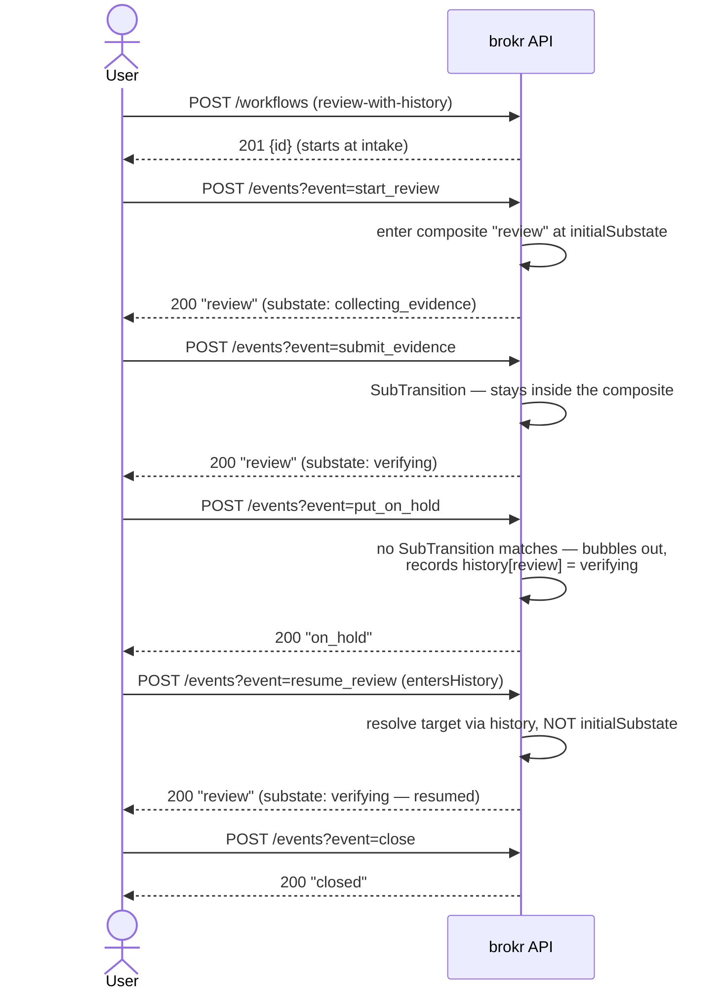

`put_on_hold` and `close` are declared only against the composite's own id (`"review"`), not any individual substate — that's what makes them bubble-out transitions, tried only after `subTransitions` finds no match for the current substate.

```bash
cp review-with-history.json workflows/ && go run ./cmd/seed-workflows
ID=$(curl -s -X POST localhost:8080/workflows -H "Content-Type: application/json" -d '{"name":"review-with-history"}' | jq -r .id)

# Watch the live position with SSE (see §12) in one terminal:
curl -N "localhost:8080/workflows/$ID/events/stream" &

curl -s -X POST "localhost:8080/workflows/$ID/events?event=start_review"
# outer response body: "review" (the composite's own id — see the API-reference note)
# the SSE event's "substate" field shows "collecting_evidence"

curl -s -X POST "localhost:8080/workflows/$ID/events?event=submit_evidence"
# a SubTransition — moves the substate to "verifying" WITHOUT leaving the composite
# outer response body: still "review"; SSE substate: "verifying"

curl -s -X POST "localhost:8080/workflows/$ID/events?event=put_on_hold"
# no subTransition matches "put_on_hold" from "verifying", so it bubbles out
# outer response body: "on_hold" — history now remembers "verifying" for "review"

curl -s -X POST "localhost:8080/workflows/$ID/events?event=resume_review"
# entersHistory:true — re-enters at "verifying", NOT back at "collecting_evidence"
# SSE substate: "verifying"

curl -s -X POST "localhost:8080/workflows/$ID/events?event=close"
# "closed"
```

Composite states support exactly one level of nesting (a composite of composites is not supported); `doActions` on a `CompositeState` itself are always `nil` — do-activities belong on the active substate, which is what the engine actually treats as "current" for do-activity purposes.

### 12. Real-time updates over SSE

Every completed transition is published on the instance's own SSE topic:

**Flow:**

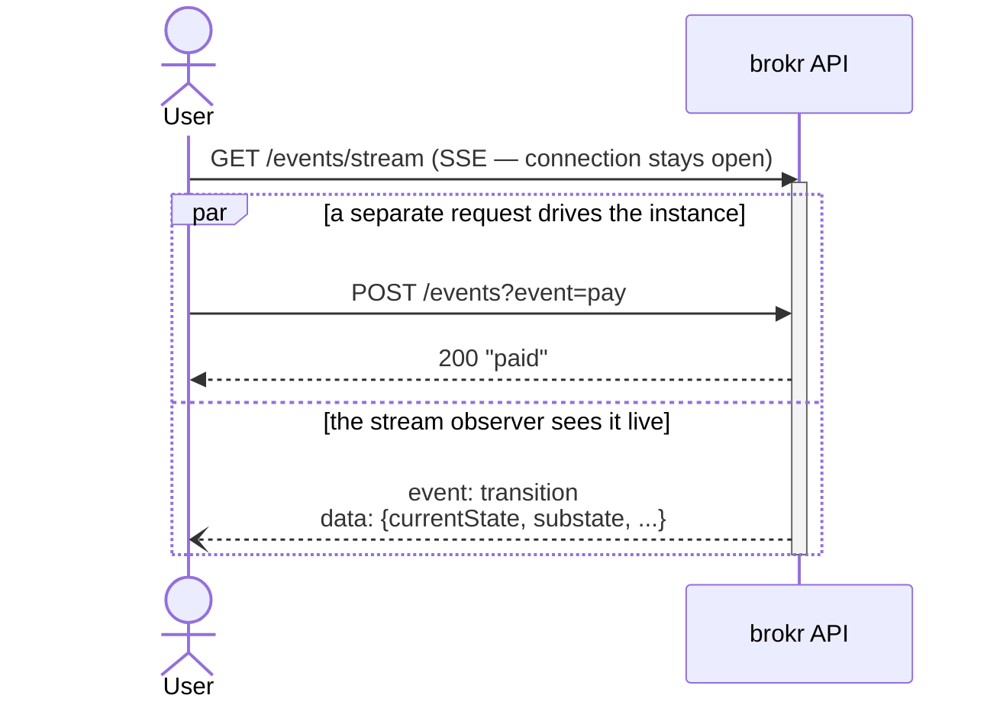

The SSE connection and the event-dispatch calls are independent — typically two different clients (or two terminals, as in [§11](#11-composite-states-and-the-history-pseudostate)'s walkthrough): one drives the workflow, the other just watches.

```bash
curl -N "localhost:8080/workflows/$ID/events/stream"
```

```
event: transition
data: {"workflowInstanceId":"...","event":"pay","lastTransition":"Event: pay, From: created, To: paid","currentState":{"type":"SimpleState","id":"paid",...},"substate":null}

```

`currentState` is the full `State` object (not just its id); `substate` is present (and non-null) only when the instance is positioned inside a `CompositeState` — see [§11](#11-composite-states-and-the-history-pseudostate). This is the only place the engine surfaces substate position over the API today.

### 13. Synchronous vs asynchronous dispatch

By default, `POST .../events` blocks until the transition (including any chained `AUTOMATIC` hops) has fully committed, and returns the resulting state. Pass `?async=true` to enqueue the event and return immediately instead — useful for a client that's already watching the SSE stream and doesn't want to hold a connection open waiting on a potentially slow chain of entry actions.

**Flow:**

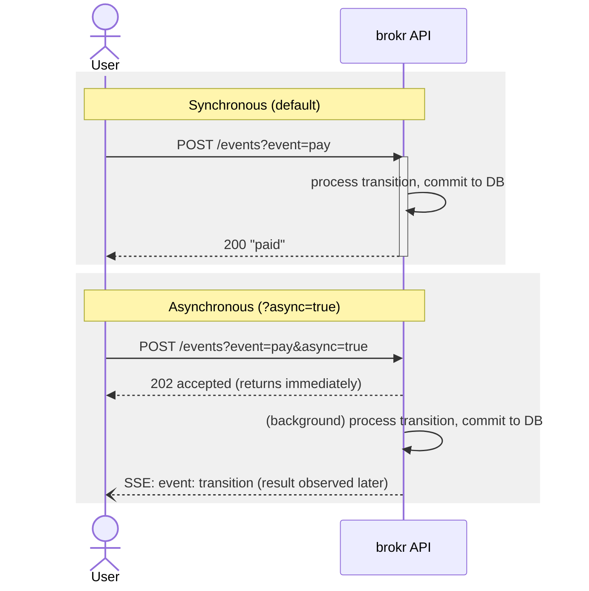

```bash
curl -s -X POST "localhost:8080/workflows/$ID/events?event=pay"
# 200 "paid"
```

```bash
curl -s -X POST "localhost:8080/workflows/$ID/events?event=pay&async=true"
# 202 {"status":"accepted","id":"...","event":"pay"}
```

Events for the *same* instance are always processed strictly one at a time regardless of sync/async — the engine runs one actor goroutine per instance and funnels every event for that instance through its mailbox — so async dispatch never introduces a race with a concurrent request against the same id. Different instances are always fully parallel.

---

## Error responses

Every error response has the shape `{"error": "message"}`. Status codes in use today:

| Status | When |
|---|---|
| `400` | malformed JSON body on `POST /workflows` (or a missing `name`) or `POST /workflows/:id/children` |
| `404` | `GET /workflows/:id`, `GET /workflows/:id/context`, or `POST /workflows` for an unregistered `name` |
| `500` | everything else — including "no transition found" and "children not complete" errors |

Note that a business-logic rejection (no matching transition for the event you sent, or a join fired before its children finished) currently returns `500`, the same as an actual server error — there's no `400`/`409` distinction yet. Inspect the `error` message to tell them apart:

```json
{"error": "no transition found for event 'ship' in state 'created'"}
{"error": "cannot fire event 'check_done' from state 'waiting_on_child': one or more child workflow instances have not completed"}
```

## Architecture notes

- **Actor-per-instance dispatcher** (`engine/dispatcher.go`): events for one instance are serialized through a per-instance mailbox channel; different instances run on independent goroutines with no cross-instance locking. Idle actors self-evict after 30s.
- **One DB transaction per event**: the row read, transition match, action execution, and row write for a single event-processing call (including any chained `AUTOMATIC` hops) happen inside one Postgres transaction.
- **Do-activities and deferred timers** are in-memory, per-instance, and cancellable — not persisted. A process restart disarms any pending one; this is a stated non-goal, not a bug.
- **Fork/Join** stamps concurrent child regions with a shared generation id (`forkGeneration`/`pendingForkGeneration`) so a second fork on the same instance can't be satisfied by a first fork's stale children.
- **Graceful shutdown**: on `SIGINT`/`SIGTERM`, the HTTP server stops accepting new requests, then the process waits for in-flight transitions, the async HTTP-action pool, all running do-activities, and all pending timers to finish/cancel before exiting.
- **Storage**: `WorkflowInstance` rows are Postgres with `jsonb` columns for the workflow definition, current state (+ composite substate), and context map. Schema migration is automatic on startup.

## Development

```bash
go build ./...                 # build
go test ./...                  # test
go test ./... -race            # test with the race detector (recommended for engine/ changes)
go vet ./...                   # vet
gofmt -w .                     # format
docker-compose up -d db && go run main.go   # run against local Postgres
```
